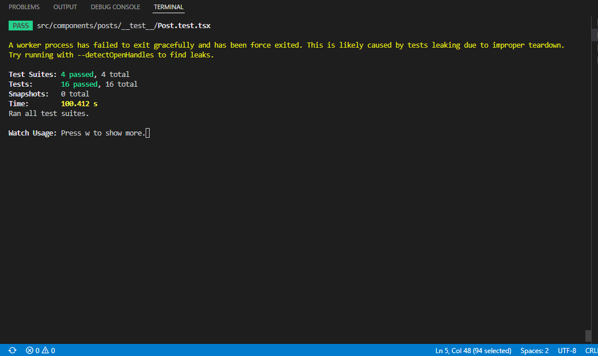
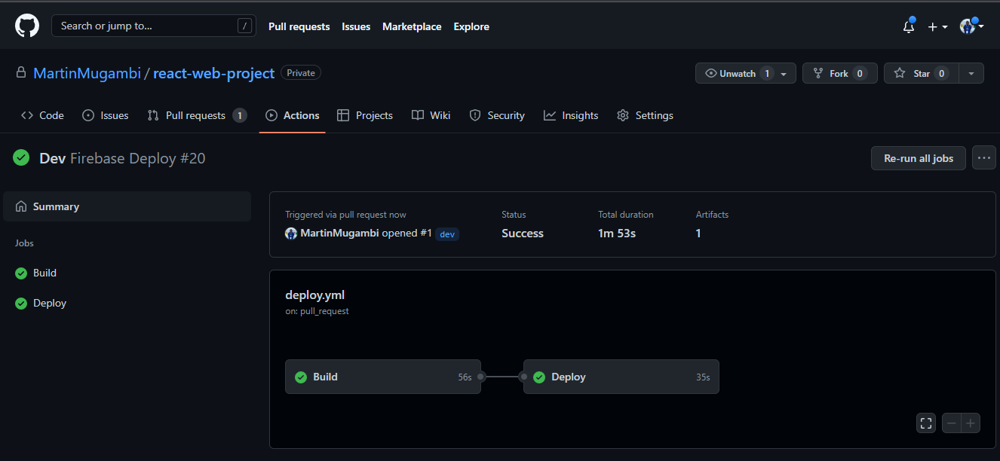

# React-web-project

[LIVE PREVIEW](https://react-web-project-e48de.web.app//)

## View on Mobile
  
Scan QR Code to View WebApp on Mobile

## Technologies used
- Technologies used
  - [React](https://reactjs.org/) - A JavaScript library for building user interfaces
  - [CSS](https://www.w3schools.com/css/) - A stylesheet language used to for styling
  - [Typescript](https://www.typescriptlang.org/) - Strongly typed language for safe incontractly to using Javasript
  - [Docker](https://www.docker.com/) - A free and open-source containerization platform.
  - [Jest](https://jestjs.io/)- A delightful JavaScript Testing Framework with a focus on simplicity.
  - [Github-Actions](https://github.com/features/actions)-  (CI/CD) platform that allows you to automate your   build, test, and deployment pipeline

- State-management

  - [Redux Toolkit](https://redux-toolkit.js.org/introduction/getting-started) - redux version for production

- UI

  - [react-loader-spinner](https://www.npmjs.com/package/react-loader-spinner) - for loader animations

### Objective
At the end of the task here are the objectives
- [x] add spinners while information is loading.
- [x] use open-sourced tools.
- [x] utilize any css method (sass, less, css modules, bootstrap, MUI, ...).
- [x] use Redux or any modern state management module 
- [x] split the application into different pages 
- [x] add tools typically used in a development environment (linters, code formatter, ...)

## Test

 

## Github Action (CI/CD)

 

## Getting Started

First, run the development server:

1. Clone the project

```bash
git clone https://github.com/MartinMugambi/react-web-project.git
```

2. Install dependecies

```bash
yarn install
```
3. Change directory

```bash
 cd react-web-project
```

4. Run the application

```bash
yarn run start
```

Open [http://localhost:3000](http://localhost:3000) with your browser to see the result.

## Deployment on Firebase

The project has been deployed to Firebase using Github action CI/CD and here is the link: [react-web-project](https://react-web-project-e48de.web.app/)
